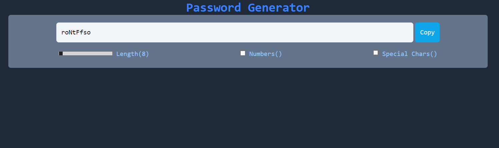

# Password Generator

A simple, customizable password generator built using React. This app allows users to generate secure passwords with customizable settings such as password length, inclusion of numbers, and special characters. The generated password can be easily copied to the clipboard.

## Features

- **Adjustable Password Length:** Set the length of the generated password (between 8 and 16 characters).
- **Include Numbers:** Option to include numbers in the password.
- **Include Special Characters:** Option to include special characters in the password.
- **Copy to Clipboard:** Easy one-click copy of the generated password.
- **Responsive Design:** The app is fully responsive and works well on both mobile and desktop devices.

## Screenshots

- 

## Installation

1. Clone this repository to your local machine:
   ```bash
   git clone https://github.com/chriswilder3/Password-Generator-React-MiniApp.git
  ```
2. Navigate to the project directory:
  ```bash
  cd Password-Generator-React-MiniApp
  ```
3. Install dependencies:
  ```bash
  npm install
  ```
4. Start the development server:
  ```bash
  npm start
  ```
5. The app will be accessible at http://localhost:3000.

## Usage

- **Password Length:** Use the slider to set the desired length for your password.
- **Include Numbers:** Check the box to include numbers in the password.
- **Include Special Characters:** Check the box to include special characters in the password.
- **Generate Password:** The password will be automatically generated based on the selected settings.
- **Copy to Clipboard:** Click the "Copy" button to copy the generated password to your clipboard.

## Technologies Used

- React
- Tailwind CSS (for styling)

